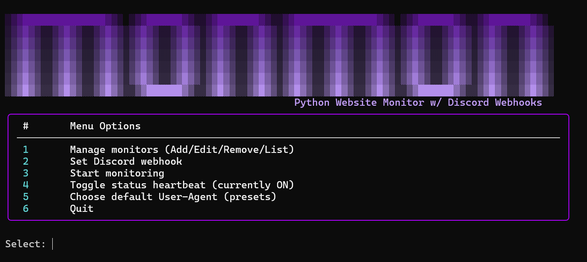

# MonMon

MonMon is a small Python 3 console app that monitors websites for changes and alerts you both in the terminal (with colored diffs) and via a Discord webhook. You can watch the entire page or just a specific CSS selector (like you would copy from your browser’s Inspect tool). Optional JS-rendered fetching is available for dynamic pages via Playwright.

---

## Features

- Monitor the whole page or a CSS selector (e.g. `.result-item`, `#main`, `div.card > h2`).
- Two compare modes:
  - `text` (DOM text content) — resilient to cosmetic HTML churn.
  - `html` (raw node HTML) — detects precise markup changes.
- Discord webhook alerts with unified diffs; console shows colored diffs.
- Selector preview when adding a monitor (accept/adjust before saving).
- Optional JS-rendered mode using Playwright for SPA/dashboards.
- ETag/Last-Modified support to reduce bandwidth and avoid noisy checks.
- Optional heartbeat status that prints “checked, no change”.
- Preset User-Agent selection (Windows, macOS, Linux, mobile, etc.).
- Saves full diffs to `diffs/` when a message has to be truncated.
  
---

## Requirements

- Python 3.8+
- Packages: Install via supplied `install-imports.py`
- Recommended (for JS-rendered pages): `pip install playwright && python -m playwright install chromium`

---

## First-time setup
1. Choose **2) Set Discord webhook** and paste your webhook URL.
2. Choose **1) Manage Monitors** and follow the prompts:
   - Enter the target URL.
   - Enter a CSS selector or press Enter to watch the whole page.
   - Pick `text` or `html` mode.
   - Choose your check frequency in seconds.
   - Optionally provide a custom User-Agent for this monitor.
   - For dynamic pages, enable JS-rendered mode and configure the wait time/selector.
   - If you provided a selector, review the preview and accept or refine it.
3. Choose **0) Start monitoring**.

---

## What exactly gets monitored?

- **Whole page:** Leave the selector blank to compare the entire HTML (or its text) each run.
- **CSS selector:** Enter something like `.of-search-domain-result-item__wrapper`. The app selects **all nodes** that match and concatenates their extracted content in document order.
  - In `text` mode, it uses each node’s visible text (descendants included).
  - In `html` mode, it uses the raw HTML for each matched node (descendants included).
  - Narrow your selector for tighter scope (e.g. `div.card > h2` vs `div.card`).

If a selector matches nothing, the app warns in the console during preview and monitoring.

---

## Alerts and Diffs

- **Console:** On change, the app prints a `[CHANGE HH:MM:SS]` line, the URL, and a colored unified diff.
- **Discord:** Sends an embed titled “Website Change Detected” with the URL, selector, mode, and a unified diff. If the message exceeds Discord’s limits, the app writes the full diff to `diffs/<timestamp>_<id>.diff.txt` and indicates that path in the embed.
- **Timestamps:** Change alerts include a timestamp in the console and as a footer in Discord embeds.
- **Heartbeat:** When enabled, the console prints periodic “checked, no change” messages.

---

## State and Files

- `monitor_state.json` stores:
  - Discord webhook URL
  - Verbose heartbeat setting
  - Global default User-Agent (if chosen)
  - Monitors and their baselines: last hash, last excerpt (first 2000 chars), `ETag`, and `Last-Modified`.
- State writes are atomic to reduce “.json.tmp access denied” issues on Windows.
- Full diffs are written to the `diffs/` directory when needed.

---

## User-Agent Presets

Use menu option **7) Choose default User-Agent (presets)** to pick a realistic UA for all monitors. You can still override per monitor when adding it.

---

## JS-rendered Mode

For sites that rely on client-side rendering (SPAs, dashboards), enable JS mode for a monitor. The app will use Playwright (Chromium) to load the page, wait either a fixed duration or an optional `wait_for` CSS selector, then capture the HTML for comparison.

---

## Troubleshooting

- **Selector matched no content:** Adjust your CSS to a parent wrapper that exists on the page, or verify the page is available without authentication.
- **304 Not Modified:** The server indicated nothing changed for the request conditions. The app still compares extracted content when new HTML is received. With 304, you may only see the heartbeat.
- **Access errors (4xx/5xx, timeouts):** These are shown in the console and also sent to Discord as “Website Access Error.”
- **Local/HTTPS issues:** For non-public endpoints, ensure the machine running the monitor can reach them and that your URL scheme (`http://` vs `https://`) is correct.
- **Too noisy:** Switch to `text` mode, narrow your selector, increase `interval_sec`, or disable heartbeat.

---

## Notes

- Use reasonable check intervals to respect target sites.
- Your Discord webhook URL is stored locally in `monitor_state.json`. Treat it as a secret.
- For large or frequent diffs, rely on the saved files in `diffs/` for full context.
